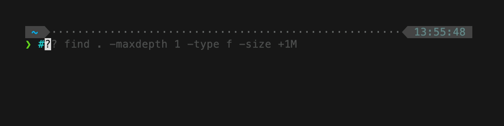
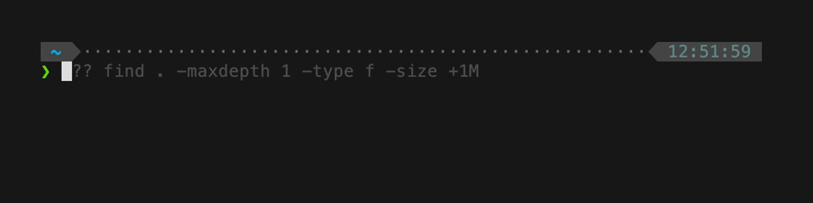
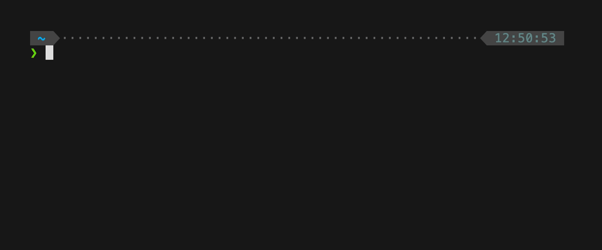
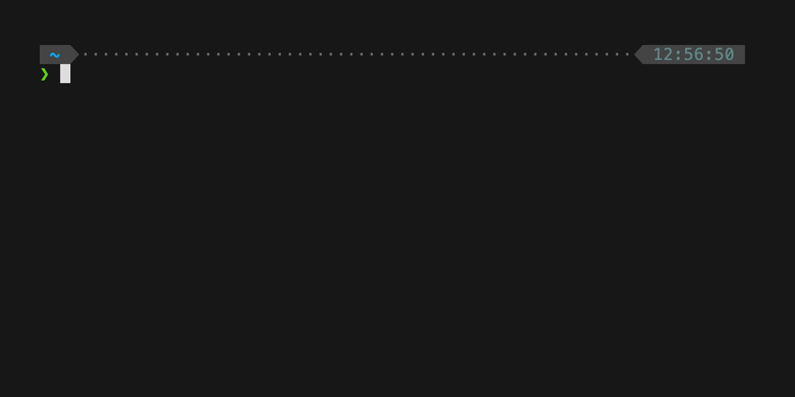

# zsh-claude-code-shell

An oh-my-zsh plugin that translates natural language comments into shell commands using [Claude Code](https://claude.ai/claude-code).

> **Note:** This is a fork of [ArielTM/zsh-claude-code-shell](https://github.com/ArielTM/zsh-claude-code-shell), which adds some improvements such as explain and generate modes.

## What It Does

This plugin provides two modes for working with shell commands using Claude Code:

### Generate Mode (`#?`)

Type `#?` followed by what you want to accomplish in natural language. The plugin generates the shell command for you.

**Example:**
```bash
#? find all js files larger than 100kb modified in the last week and show their sizes
```
Press Enter, and the line becomes:
```bash
find . -name "*.js" -size +100k -mtime -7 -exec ls -lh {} \;
```
Review the command, press Enter again to execute.



More examples:



**Context-Aware: The plugin has access to your last executed command**

```bash
$ grp -r "TODO" src/           # Oops, typo!
-bash: grp: command not found

$ #? fix last command
# becomes: grep -r "TODO" src/

$ git commit -m "fix bug"      # Just committed
$ #? amend last commit to add forgotten file config.json
# becomes: git add config.json && git commit --amend --no-edit

$ docker ps                     # See running containers
$ #? stop all containers from last command
# becomes: docker ps -q | xargs docker stop
```



### Explain Mode (`#??`)
Type `#??` followed by a command you don't understand. The plugin explains what it does in plain English.

**Example:**
```bash
#?? find . -type f -exec du -h {} + | sort -rh | head -10
```
Press Enter, and you'll see an explanation like:
```
This command finds the 10 largest files in the current directory:
1. find . -type f: Finds all files recursively
2. -exec du -h {} +: Gets human-readable size of each file
3. sort -rh: Sorts by size (largest first)
4. head -10: Shows only the top 10 results
```



**🔑 You can also explain your last command** without retyping it:

```bash
$ tar -xzf archive.tar.gz -C /tmp --strip-components=1
# What did I just do?

$ #?? explain last command
# Shows explanation of the tar command you just ran
```

### Debug Mode (`--DEBUG`)
Both modes support a `--DEBUG` flag to see the full prompt sent to Claude before execution. This helps you understand what context is being provided and how your query is being interpreted.

**Example:**
```bash
#? --DEBUG find all typescript files
```
This will print:
```
=== DEBUG MODE ===

Mode: generate

System Prompt:
----------------
You are a shell command generator. The user may provide their last executed command...

User Prompt:
------------
Current directory: ~/Projects/my-app
Last command: npm install

User request: find all typescript files

=================
```
Then it will proceed to generate the command as usual. Works with both `#?` and `#??` modes.

## Prerequisites

- [Claude Code CLI](https://claude.ai/claude-code) installed and authenticated
- zsh shell
- [oh-my-zsh](https://ohmyz.sh/) (optional, for easiest installation)

## Installation

### oh-my-zsh

Clone to your custom plugins directory:

```bash
git clone https://github.com/leochatain/zsh-claude-code-shell ${ZSH_CUSTOM:-~/.oh-my-zsh/custom}/plugins/zsh-claude-code-shell
```

Add to your `~/.zshrc`:

```bash
plugins=(... zsh-claude-code-shell)
```

Restart your shell or run `source ~/.zshrc`.

### Manual

Clone the repository and source the plugin:

```bash
git clone https://github.com/leochatain/zsh-claude-code-shell ~/zsh-claude-code-shell
echo 'source ~/zsh-claude-code-shell/zsh-claude-code-shell.plugin.zsh' >> ~/.zshrc
```

### zinit

```bash
zinit light leochatain/zsh-claude-code-shell
```

### zplug

```bash
zplug "leochatain/zsh-claude-code-shell"
```

## Configuration

Set these environment variables in your `~/.zshrc` before the plugin loads:

| Variable | Default | Description |
|----------|---------|-------------|
| `ZSH_CLAUDE_SHELL_DISABLED` | `0` | Set to `1` to disable the plugin |
| `ZSH_CLAUDE_SHELL_MODEL` | `sonnet` | Claude model to use (e.g., `sonnet`, `opus`, `haiku`) |
| `ZSH_CLAUDE_SHELL_DEBUG` | `0` | Set to `1` to show stderr output from Claude CLI (errors and warnings) |
| `ZSH_CLAUDE_SHELL_FANCY_LOADING` | `1` | Set to `0` to use simple loading message instead of animated spinner |

**Note:** The `ZSH_CLAUDE_SHELL_DEBUG` variable is different from the `--DEBUG` flag. The variable shows Claude CLI errors, while the `--DEBUG` flag prints the full prompt being sent to Claude on a per-query basis.

### Example

```bash
# Use a specific model
export ZSH_CLAUDE_SHELL_MODEL="sonnet"

# Temporarily disable
export ZSH_CLAUDE_SHELL_DISABLED=1
```

## License

MIT
